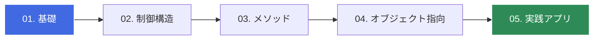

# 🚀 C# Zero to Hero: 基礎から学ぶ実践プログラミング

C# の基礎を、最短ルートで身につけるための学習リポジトリです。
環境構築からオブジェクト指向、そして実践的なアプリケーション開発までを一歩ずつ学んでいきましょう。

---

## 🗺️ 学習ロードマップ

この教材では、以下のステップで学習を進めます。

---

© 2026 Reki Yamamoto - Distributed under the MIT License.
