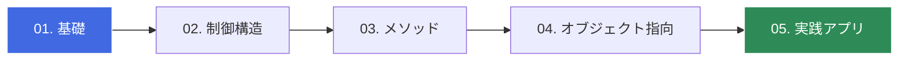

# 🚀 C# Zero to Hero: 基礎から学ぶ実践プログラミング

C# の基礎を、最短ルートで身につけるための学習リポジトリです。
環境構築からオブジェクト指向、そして実践的なアプリケーション開発までを一歩ずつ学んでいきましょう。

---

## 🗺️ 学習ロードマップ

この教材では、以下のステップで学習を進めます。

## 📚 目次 (Contents)

| 章 | タイトル | 内容 | ステータス |
| :--- | :--- | :--- | :---: |
| **Section 1** | [イントロダクション](./docs/01_intro.md) | 環境構築・Hello World の表示 | ✅ |
| **Section 2** | [C#の基本文法](./docs/02_basics.md) | 変数・型・演算子の使い方 | ✅ |
| **Section 3** | [制御構造](./docs/03_control.md) | 条件分岐(if)と繰り返し(for/while) | ✅ |
| **Section 4** | [配列とリスト](./docs/04_collections.md) | データの集合を扱う (List<T>) | 🚧 |
| **Section 5** | [オブジェクト指向](./docs/05_oop.md) | クラス・継承・カプセル化 | 📅 |
| **Section 6** | [実践演習](./docs/06_practice.md) | コンソールアプリの作成 | 📅 |

## 🛠️ この教材の進め方
1. リポジトリを Fork する
右上の [Fork] ボタンを押し、自分のアカウントにこの教材をコピーしてください。

2. 学習環境を立ち上げる
このリポジトリは GitHub Codespaces に対応しています。

  - `Code` ボタン（緑色）をクリック。
  - `Codespaces` タブを選択。
  - `Create codespace on main` をクリック。 これで、ブラウザ上にすぐ開発環境が立ち上がります。

3. 学習と演習
  - `docs/` フォルダにある解説を読みます。
  - `src/` フォルダにあるサンプルコードを実行して動作を確認します。
  - `exercises/` フォルダにある課題を解き、自分のコードを Push してください。

---

© 2026 Reki Yamamoto - Distributed under the MIT License.
