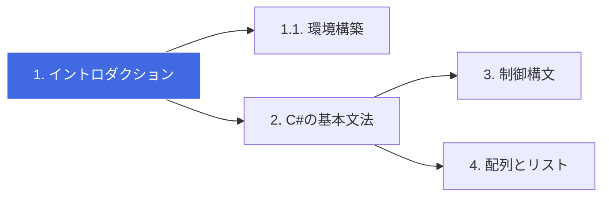

# 🚀 C# Zero to Hero: 基礎から学ぶ実践プログラミング

[](https://github.com/nenaaki/csharp_zoro_to_hero)
[](https://dotnet.microsoft.com/download)
[](https://dotnet.microsoft.com/download)

C# の基礎を、最短ルートで身につけるための学習リポジトリです。
環境構築からオブジェクト指向、そして実践的なアプリケーション開発までを一歩ずつ学んでいきましょう。

---

## 🗺️ 学習ロードマップ

この教材では、以下のステップで学習を進めます。



## 📚 目次 (Contents)

| 章 | タイトル | 内容 | ステータス |
| :--- | :--- | :--- | :---: |
| **1** | [イントロダクション](./docs/01_intro.md) | 最初の環境構築・Hello World の表示 | ✅ |
| **1.1** | [.NET 環境セットアップ](./docs/01_setup.md) | .NET SDK の導入と確認手順 | ✅ |
| **2** | [C#の基本文法](./docs/02_basics.md) | 変数・型・演算子の使い方 | ✅ |
| **3** | [制御構文](./docs/03_control.md) | 条件分岐(if)と繰り返し(for/while) | ✅ |
| **4** | [配列とリスト](./docs/04_collections.md) | データの集合を扱う (List<T>) | ✅ |
| **5** | [オブジェクト指向](./docs/05_oop.md) | クラス・継承・カプセル化 | 📅 |
| **6** | [実践演習](./docs/06_practice.md) | コンソールアプリの作成 | 📅 |
| **6.1** | [ストリーム](./docs/06_streams.md) | ファイルなどの読み書き | ✅ |
| **6.2** | [エンコーディング](./docs/06_encoding.md) | 文字列のエンコードを切り替える | ✅ |
| **データアクセス** | [Entity Framework 入門](./docs/08_entity_framework.md) | EF Core の導入とマイグレーション | 🚧 |
| **Web アプリ** | [Blazor 入門](./docs/09_blazor.md) | Blazor Server / WASM の基本 | 🚧 |

## 🛠️ この教材の進め方

[GitHub UI - Sync fork button](./images/github-ui.png)

1. リポジトリを Fork する
右上の [Fork] ボタンを押し、自分のアカウントにこの教材をコピーしてください。

> **Fork した方へ（重要）:** 元リポジトリの更新を取り込むため、定期的にフォークを同期（Sync fork）してください。ローカルで同期する簡単な手順の例:

```
git remote add upstream https://github.com/nenaaki/csharp_zoro_to_hero.git
git fetch upstream
git merge upstream/main
```

または GitHub のウェブ UI にある「 **Sync fork** 」機能を使って更新を取り込んでください。（推奨）

2. 学習環境を立ち上げる
このリポジトリは GitHub Codespaces に対応しています。

  - `Code` ボタン（緑色）をクリック。
  - `Codespaces` タブを選択。
  - `Create codespace on main` をクリック。 これで、ブラウザ上にすぐ開発環境が立ち上がります。

3. 学習と演習
  - `docs/` フォルダにある解説を読みます。各章にある課題に取り組んでください。
  - `src/` フォルダにあるサンプルコードをローカル環境で実行して動作を確認します。（前提：ローカルPCに開発環境を構築済みであること）
  - `exercises/` 各章の課題を解き、自分のコードを Push してください。（Codespaceで実装しても良い）


---

© 2026 Reki Yamamoto - Distributed under the MIT License.

## 付録

- **.NET と C# 言語バージョン対応表:** [docs/05_dotnet_csharp_versions.md](docs/05_dotnet_csharp_versions.md#L1)
